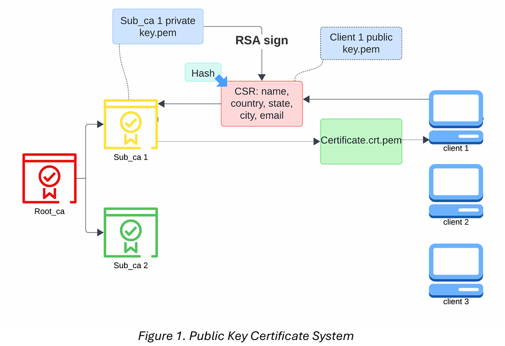

# Public-key-encrpytion-system
This project implements a **Public Key Infrastructure (PKI)** system using Python simulating the operation of a real-world Certificate Authority (CA) hierarchy.  
It includes a **Root Certificate Authority (Root CA)**, **two Subordinate CAs (Sub-CAs)**, and **multiple client entities**, each with secure certificate issuance, validation, and revocation functionalities.
## Project Overview
The goal of this project is to demonstrate how a **public key encryption and certification system** works by building it from scratch.  
It showcases essential PKI operations, including:

- Generation of CA and client key pairs  
- Certificate issuance and signing  
- Client registration and certificate requests  
- Certificate validation and revocation  
- Secure communication using public/private key cryptography


## How to Run
1. Clone the repository:
   ```bash
   git clone https://github.com/bforbugs/Public-key-encryption-system.git
   ```
2. Change directory:
```bash
cd public-key-encryption-system
```
3. Add required packages
```bash
python -r requirements.txt
```
4. run the main file
```bash
python src/root_ca.py
```
